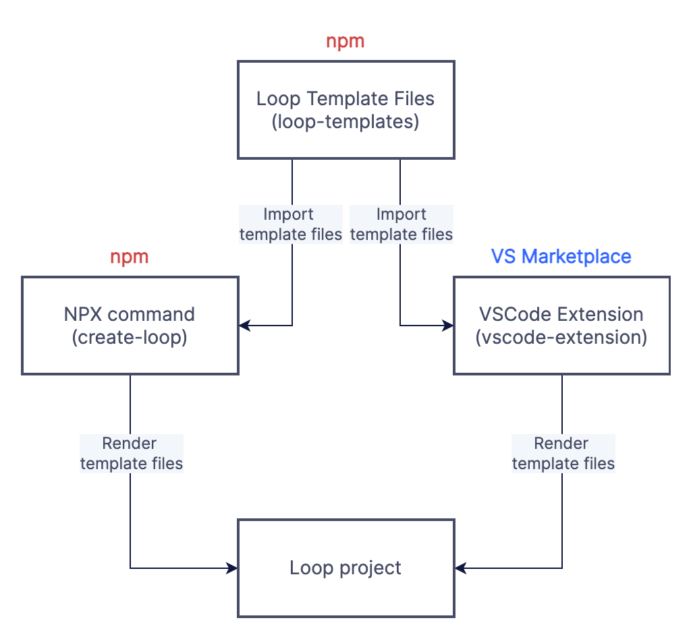

# Loop Generators

## What is a Loop generator?

A Loop generator is one of the tools we provide for developers to easily create a new Loop with pre-built examples for Aptitudes and Whisper components. The developer can select which Aptitudes they want to use and we automatically generate a working project for them, even without any input from them; they could use a Loop generator and immediately build the Loop and successfully install it and run it without changing anything.

We currently provide two tools for generating Loops:

### VSCode Extension

VSCode is a lightweight developer environment/code editor that approximately 70% of
developers use to write code, probably even more for JavaScript developers. VSCode
supports extensions that add more features and functionality to the environment. Our
VSCode extension Loop generator allows you to use a UI we provided to create a Loop.

### NPX Command

NPM is a package registry and manager for JavaScript projects, which one would use to add
and leverage new libraries in their code. For example, when building a Loop, you would
use NPM to add the LDK to your project, then import and use it in your code.

NPM provides a command to run scripts from their registry, known as `npx`. Using npx in
your terminal, you can locally execute a script pulled down from the npm registry.
Usually, this command is used to bootstrap a new project - the best and most used example
being `npx create-react-app` to bootstrap a new React app.

Running `npx @oliveai/create-loop` will produce an interactive UI in the terminal that you
can use to generate a loop.

## Prerequisites

### Required tools

To pull the codebase and run our Loop generators in a development environment for
testing, you need to confirm you have a few things installed on your computer.

* Node
  * Check if you have it: run `node --version` in your terminal, should return a version number
  * If you don’t have it: https://github.com/nvm-sh/nvm
* VSCE
  * Check if you have it: run `vsce --version` in your terminal, should return a version number
  * If you don’t have it: run `npm i -g vsce` in your terminal
* Visual Studio Code (VSCode)
  * If you don’t have it: https://code.visualstudio.com/download

## How the packages interact

### The Three Musketeers

There are three different packages in this repository:

* `create-loop`: The npm package containing the `npx @oliveai/create-loop` script
* `vscode-extension`: The package containing the source code for the
[VSCode Extension](https://marketplace.visualstudio.com/items?itemName=Olive-AI.vscode-loop-development-kit)
* `loop-templates`: The npm package containing the Loop template files that the above two
packages use to generate a Loop.



### Why is loop-templates an npm package

To use a single source for the template files between the NPX command and VSCode
extension, we publish the `loop-templates` package to the npm registry so that both tools
can use it and share the same templates. This idea is similar to Meta publishing
`cra-template` as an npm package for `create-react-app` and their other tools to use.

## Developing for loop-templates

### Overview

* The template files make use of the [Squirrelly template engine](https://squirrelly.js.org/)
and end with `.squirrelly`
* Every directory contains an `index.ts` containing a `fileMap` object
  * `fileMap` objects follow this structure, where the `key` is the name of an imported
template file or directory of templates:
```ts
{
  [key: string]: {
    fileName: string, // Name that the file should be given when rendered
    aptitude: string, // An enum that determines which aptitudes will cause this to render
  }
}
```
* The loop generators, `create-loop` and `vscode-extension`, recursively loop through the
`fileMap` objects in each directory and determine which files to render based on the
aptitudes that the user selects

### Creating/updating template files

There is no VSCode extension for enabling syntax highlighting or other language features
for Squirrelly template files. For creating templates, we've found the best luck with one
of two methods:

1. Write the "final" code as a standard TypeScript file, then change the file extension
to Squirrelly and "template" the TypeScript syntax so it only renders if the user selects
TypeScript.
    * We recommend generating a JavaScript Loop to confirm you didn't miss any of
the TypeScript syntax, as trying to build a JS file with TS syntax in it will immediately
point it out.
2. Put `<script>` at the top of the file and `</script>` at the bottom, then change the
language in VSCode to Handlebars. You can freely write JavaScript w/ templating and get
syntax highlighting.

### Development steps

1. Make changes/additions to the template files and any relevant `fileMap` objects
2. Run `npm run build` to compile the templates into importable code
3. In `create-loop` change the `@oliveai/loop-templates` dependency version to the local version, like so:
```json
"dependencies": {
  "@oliveai/loop-templates": "file:../loop-templates",
  ... // other dependencies here
}
```
4. Run `npm install` in the `create-loop` directory
5. Run `npm run dev` -- this is effectively the same as running `npx @oliveai/create-loop`
but it's just using your local script instead of the script in the npm registry

This will generate a Loop with the changes you made in the templates.

### Publishing changes

If you make changes to `loop-templates` and are bumping the version number, make sure the
new version is used in the dependencies of `create-loop` and `vscode-extension` as well

## Developing for create-loop

### Overview

* The `create-loop` script is very simple: it's just a Node.js script file `index.js`
* Running `npm run dev` is effectively the same as running `npx @oliveai/create-loop`
* The script renders templates provided by the `loop-templates` package

### Development steps

1. Make changes to the script in the `index.js` file
2. Run `npm run dev` to run the script locally

## Developing for vscode-extension

### Overview

* Most of the logic is in `src/loopCreator.ts`
* With that file open, if you press F5 it will open a VSCode window in debug mode with the
extension installed
* Alternatively, running `vsce package` will produce an extension file that you can install
* The extension takes the user input from the HTML form to define the relevant variables in
`loopCreator.ts` which then renders templates provided by the `loop-templates` package

### Development steps

1. Make changes to the extension source code
2. Press F5 to run the debugger, which will open a new VSCode window with the local
development version of the extension installed
3. Press Cmd+Shift+P to open the command palette, type in "Create Loop", and select
the option provided by our extension
