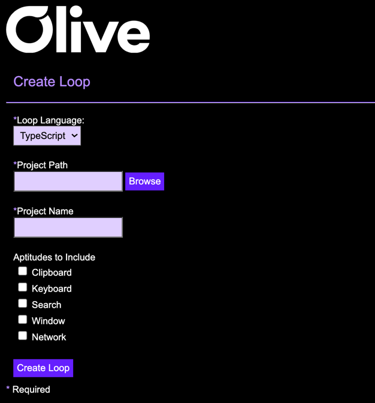

# Loop Development Kit README

Loop Development Kit is an extension to generate boiler plate code to create loops for Olive Helps.

You can download Olive Helps here: [Windows](<https://olive.page.link/olive-helps-windows>) [Mac](<https://olive.page.link/olive-helps-mac>)

It supports generating loop code in Typescript and ES6 Javascript.

## Usage

To get started use cmd/(mac/)/ctrl/(win/)+shift+p and type Create Loop
This will open the Create Loop form to populate with the loop details.

Next [check the latest version of the LDK] (<https://github.com/open-olive/loop-development-kit>) and update it in the Create Loop form.

Select your preferred language.

Browse to find the location where you want your project to exist.

Give your loop project a name.

Select the Aptitude's you want to include in your loop.

For security purposes you need to provide the reason you are using the aptitude.
-State why the sensor is needed for the Loop and how it is being used
-State what information is collected as a result of using the sensor and what the data is used for
-Example: “We need access to your clipboard to detect when you copy a phone number, so that we can automatically do a phone number verification check for you.”

If you choose to use the network sensor to make http requests you will need to provide the url you will be accessing and the reason you are making requests to that url.

If you want to use more than one URL in your loop be sure you update package.json to include the additional urls.

Click create loop, this will open a new VS Code window with your project.

You will need to run [npm i] to install the loop and [npm run build] to generate the loop.

Now you can install your loop locally in Olive Helps, to do this open the Loop Library in Olive Helps and click Install Local Loop.

Enter the name of your loop and browse to your loop project location and select the dist folder that was created when you ran npm build.

## Requirements

You must have [node js](<https://nodejs.org/en/download/>) installed to build your loop.

You must have Olive Helps installed to be able to use and test your loop. [Windows](<https://olive.page.link/olive-helps-windows>) [Mac](<https://olive.page.link/olive-helps-mac>)

## Release Notes

Initial release

**Enjoy!**
