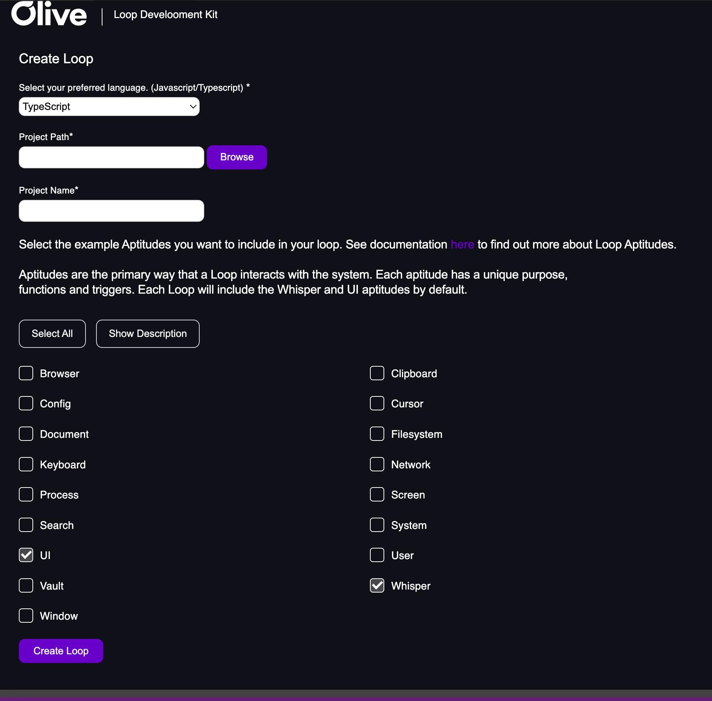

# Loop Creator Extension for VSCode

This is a VSCode extension to generate boilerplate code to create Loops for Olive Helps.

You can download Olive Helps here:

- [Windows](https://olive.page.link/olive-helps-windows)
- [Mac](https://olive.page.link/olive-helps-mac)

It supports generating Loop code in Typescript and JavaScript (ES6).

## Usage

To get started, press Cmd(Mac)/Ctrl(Windows)+Shift+p and type "Create Loop". This will open the Create Loop form to populate with the loop details.



Select your preferred language.

Browse to find the location where you want your project to exist.

Give your loop project a name.

Select the example Aptitudes you want to include in your loop.

Click create loop, this will open a new VSCode window with your project.

You will need to run `npm install` to install packages and `npm run build` to build the loop.

You can also use the provided configs to lint and test your code:

```shell
# ESLint and Prettier
npm run lint          # Check for issues
npm run lint:fix      # Fix all auto-fixable issues

# Jest
npm run test          # Run unit tests
npm run test:coverage # Run unit tests with coverage report
```

Now you can install your loop locally in Olive Helps. To do this open the Loop Library in Olive Helps
and click "Install Local Loop".

Enter the name of your loop and browse to your loop project location and select the `dist` folder
that was created when you ran `npm run build`.

## Requirements

You must have [Node.js](https://nodejs.org/en/download/) installed to build your Loop.

You must have Olive Helps installed to be able to use and test your Loop:

- [Windows](https://olive.page.link/olive-helps-windows)
- [Mac](https://olive.page.link/olive-helps-mac)

## Extension Development

For more detailed info, look [here](./vsc-extension-quickstart.md).

To change the VSCode extension itself, follow these instructions:

1. Clone the repository.
2. Make changes. You can run the source in debug mode from VSCode by selecting Run > Start Debugging (F5). This will launch a separate VSCode extension window with the extension under development installed.
3. Add entries as needed in CHANGELOG.md.
4. Bump the version of the extension itself in `package.json`.
5. When you're ready to publish, generate an extension package by running `npx vsce package` in the source directory.
6. Upload this to the VSCode extension store (requires appropriate permissions).

**Enjoy!**
